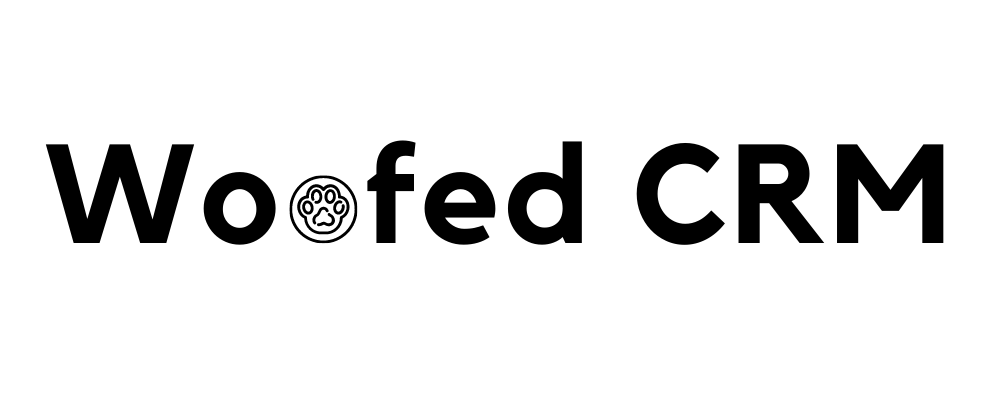
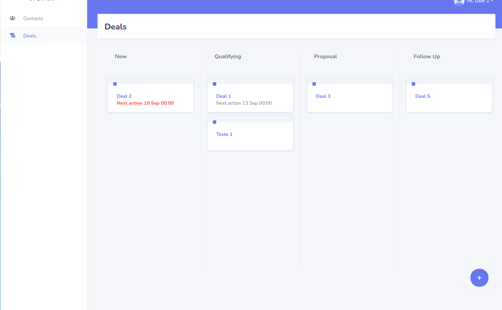

Woofed CRM is a Open source CRM Software. 

## ❗Under development ❗

## Let's try 🌟

You can try the development version through the link: [WoofedCRM](https://woofedcrm.com)



## API 🔥

[API documentation](https://www.postman.com/dark-shuttle-5185/workspace/woofed-crm-api/collection/905262-e0bb0d71-a634-4fa2-8b03-4ae4c6dde690)
## Installation Tutorial 🧑‍💻

Requeriments for project:
```
ruby 3.3.4
nodejs 16.16.0
```

1 - Clone repository
```
git clone https://github.com/douglara/woofed-crm.git
cd woofed-crm
```

2 - Install dependencies
```
bundle install
yarn build
```

3 - Create a .env file
```
cp .env.sample .env
```

4 - Up containers
```
docker compose up -d
```

5 - Configure database
```
rails db:create
rails db:migrate
rails db:seed
```

6 - Start applications
```
./bin/dev
```
## Access 👀

Access `http://127.0.0.1:3001` and use user `user1@email.com` password: `123456`

## Community 🔔

+ [WhatsApp](https://chat.whatsapp.com/BFCtnmHgNtJHnIBFBgqud7)
+ [Instagram](https://www.instagram.com/woofedcrm/)
+ [Discord](https://discord.gg/MQPNNCC6aq)

## Contributors 💪

<a href="https://github.com/douglara/woofed-crm/graphs/contributors">
  
</a>

Made with [contrib.rocks](https://contrib.rocks).
