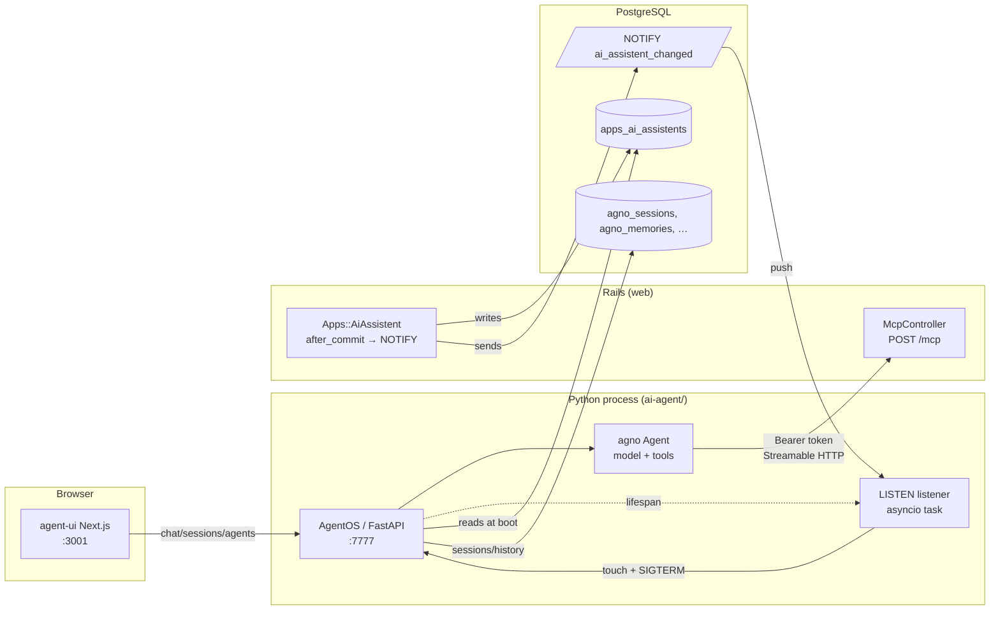
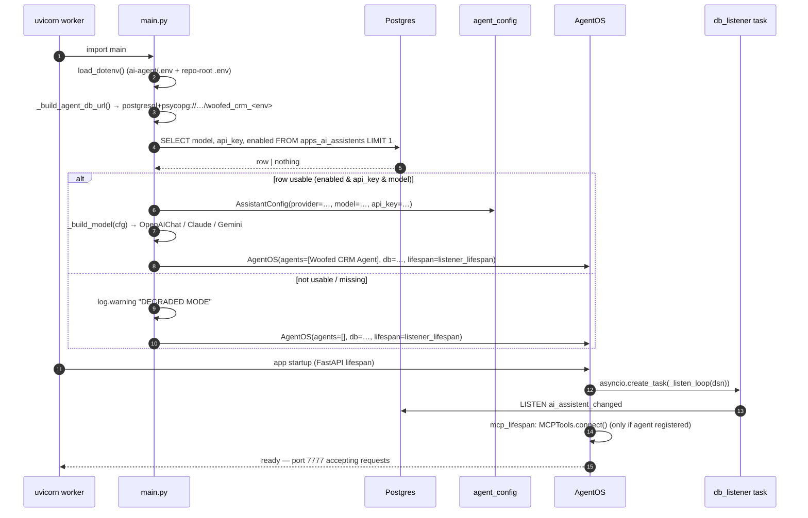
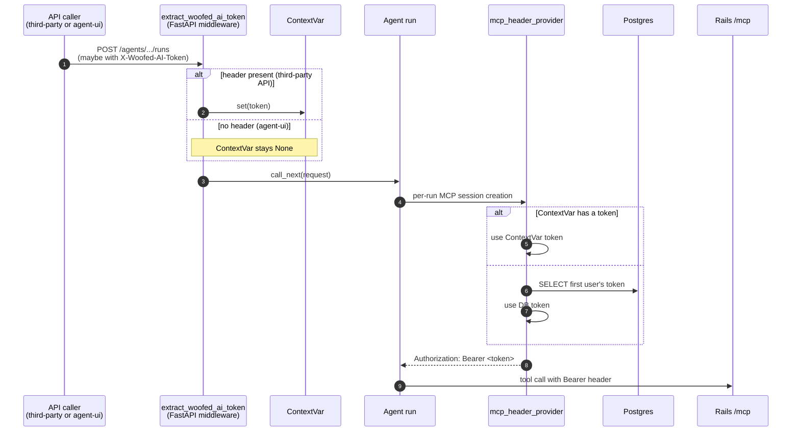

# AI agent — architecture

The Woofed AI agent is a Python service (FastAPI + [agno](https://github.com/agno-agi/agno)) that wraps the [Woofed MCP](../mcp/readme.md) and exposes a chat UI for operators. This document explains how the agent boots, where its model/api_key come from, and how it stays in sync with `Apps::AiAssistent` without a manual restart.

---

## Table of contents

1. [High-level flow](#high-level-flow)
2. [Components](#components)
3. [Boot sequence](#boot-sequence)
4. [Degraded mode](#degraded-mode)
5. [Restart on `Apps::AiAssistent` change](#restart-on-appsaiassistent-change)
6. [Per-environment behavior](#per-environment-behavior)
7. [Provider detection](#provider-detection)
8. [File layout](#file-layout)

---

## High-level flow



---

## Components

| Component | File | Role |
|---|---|---|
| `try_load_assistant_config` | [ai-agent/agent_config.py](../../ai-agent/agent_config.py) | Reads the first row of `apps_ai_assistents`, picks the provider from the model string, returns `None` if not usable. |
| `start_listener_task` | [ai-agent/db_listener.py](../../ai-agent/db_listener.py) | Asyncio task that holds a dedicated psycopg connection on `LISTEN ai_assistent_changed` and, on notify, fires `touch_trigger()` + `SIGTERM`. |
| Bootstrap + `AgentOS` | [ai-agent/main.py](../../ai-agent/main.py) | Loads `.env`, builds the SQLAlchemy URL, queries `apps_ai_assistents`, builds the right agno `Model` class, registers the agent (or not, in degraded mode), wires the listener into the FastAPI lifespan. |
| `after_commit :notify_agent_restart` | [app/models/apps/ai_assistent.rb](../../app/models/apps/ai_assistent.rb) | Runs `NOTIFY ai_assistent_changed` after every commit (create/update/destroy). |

---

## Boot sequence



---

## Degraded mode

The agent never refuses to start because of a missing/disabled `Apps::AiAssistent`. Instead:

| Condition | Effect |
|---|---|
| No row exists | `try_load_assistant_config()` returns `None` |
| Row exists but `enabled = false` | returns `None` |
| Row exists but `api_key` is blank | returns `None` |
| Row exists but `model` is blank | returns `None` |

When `assistant is None`:

- `AgentOS` is built with `agents=[]`.
- The FastAPI app still boots, `/health` and metadata endpoints work, and the listener keeps running.
- The agent-ui shows no agents available — chat is effectively disabled.
- A `WARNING` is logged exactly once, at boot. The process does not keep retrying or spam logs.

Rails keeps working regardless. The two processes are independent and the Rails app does not depend on the agent for anything.

---

## Restart on `Apps::AiAssistent` change

Goal: when an operator creates / updates / deletes the `Apps::AiAssistent`, the agent must pick up the new config without anyone touching the agent process.

```mermaid
sequenceDiagram
    autonumber
    participant Op as Operator
    participant Web as Rails web
    participant PG as Postgres
    participant Lis as agent listener
    participant Sup as Supervisor<br/>(uvicorn --reload / k8s / systemd / …)
    participant New as new agent worker

    Op->>Web: save Apps::AiAssistent (Settings → AI Assistant)
    Web->>PG: BEGIN; UPDATE apps_ai_assistents …; COMMIT
    Note over Web: after_commit fires
    Web->>PG: NOTIFY ai_assistent_changed
    PG-->>Lis: push notification (sub-ms latency)
    Lis->>Lis: touch agent_config.py (bump mtime)
    Lis->>Sup: os.kill(pid, SIGTERM)
    Sup->>Sup: detect worker exit / file change
    Sup->>New: spawn fresh worker
    New->>PG: SELECT … FROM apps_ai_assistents (boot sequence above)
    New-->>Op: chat works with new model/api_key
```

Two restart mechanisms fire in sequence; whichever applies to the current environment wins:

1. **`touch_trigger()`** — bumps the mtime of `agent_config.py`. Picked up by `uvicorn --reload` (dev). Idempotent in prod where no reload watcher exists.
2. **`SIGTERM`** — exits the worker. The supervisor (kubernetes, docker `--restart`, systemd `Restart=always`, heroku dyno manager, overmind with restart config) spawns a fresh process.

The new process re-runs the boot sequence, so any state from the previous process (in-memory MCP tool list, agno session caches, etc.) is discarded and rebuilt from scratch — eliminating drift between the running config and the DB.

### Why a separate Postgres connection for LISTEN

`db_listener.py` opens its own `psycopg.AsyncConnection` instead of borrowing one from the SQLAlchemy pool used by agno. Two reasons:

- `LISTEN` requires a long-lived, autocommit connection. Pinning a pooled connection would starve the pool and break under reconnects.
- psycopg's async `notifies()` generator is the native API for streaming notifications; SQLAlchemy doesn't surface it.

### Failure modes

| Failure | Listener behavior |
|---|---|
| Postgres restart | psycopg disconnects; `_listen_loop` catches, logs, sleeps 5s, reconnects, re-`LISTEN`s. |
| NOTIFY sent during disconnect | Lost. `NOTIFY` has no persistence (it's not a queue). Operator must save again, or restart manually. |
| Touch fails (permissions / readonly fs) | Logged, but SIGTERM still fires. |
| SIGTERM not honored by supervisor | Process exits, supervisor doesn't restart → agent stays down. Document `restartPolicy: Always` (k8s) / `Restart=always` (systemd) / `restart: always` (docker) requirement. |

---

## Per-environment behavior

| Environment | Reload mechanism | What `bin/dev` / supervisor needs |
|---|---|---|
| Dev with overmind (`bin/dev` default) | uvicorn `--reload` picks up the touch. SIGTERM is redundant but harmless. | Nothing — `Procfile.dev` runs `uv run main.py` with `reload=True`. |
| Dev with foreman | Same touch path. SIGTERM would kill the foreman group if process restart isn't configured. | Prefer overmind; foreman is the fallback in `bin/dev`. |
| Docker / docker-compose | No reload watcher. SIGTERM exits container. | `restart: always` (compose) or `--restart always` (docker run). |
| Kubernetes | No reload watcher. SIGTERM exits pod. | `restartPolicy: Always` (default in Deployment / StatefulSet). |
| Docker Swarm | Auto-restart of failed tasks is the default. | No extra config. |
| systemd | Unit must opt in to restarting on exit. | `Restart=always` in the `.service` unit. |
| Heroku-style (dyno managers) | Auto-restart on crash. | No extra config. |

If a supervisor lacks auto-restart, the agent will stay down after the first NOTIFY-triggered SIGTERM. This is acceptable when the operator wants to manage the lifecycle manually.

---

## Provider detection

`Apps::AiAssistent.model` is a free-text field, so the agent classifies it heuristically (in [agent_config.py](../../ai-agent/agent_config.py)):

| Substring (case-insensitive) | Provider | agno class | Examples |
|---|---|---|---|
| `claude`, `sonnet`, `opus`, `haiku` | `anthropic` | `agno.models.anthropic.Claude` | `claude-sonnet-4-5`, `claude-opus-4-1` |
| `gemini` | `google` | `agno.models.google.Gemini` | `gemini-2.5-flash`, `gemini-1.5-pro` |
| anything else (default) | `openai` | `agno.models.openai.OpenAIChat` | `gpt-4o`, `gpt-3.5-turbo`, `o1-mini`, `o3-mini` |

To add a provider: extend `_detect_provider()` and `_build_model()` in `agent_config.py` / `main.py`, and add the SDK to `pyproject.toml`.

---

## MCP authentication — per-user tokens

Each Rails user owns one long-lived Doorkeeper access token (scope `mcp`, `resource: <FRONTEND_URL>/mcp`). The Python agent does not hold a single shared token — it resolves the right one *per request*.

### Where the tokens come from

| Source | When it fires |
|---|---|
| Migration `BackfillWoofedAiTokensForUsers` | One-shot — mints a token for each pre-existing user. |
| `User::WoofedAiTokenMinter` (`after_create`) | Every time a new user is created (signup, console, factory). |

Both paths create a `Doorkeeper::AccessToken` row tied to `application.name = 'Woofed AI'`. Nothing is stored on the `users` table — `oauth_access_tokens` is the single source of truth, joined by `resource_owner_id`.

### How the agent picks a token per request



### Token resolution rules

1. Caller sends `X-Woofed-AI-Token: <token>` → that token is used.
2. No header → fallback to *the first user's* active token (lowest `resource_owner_id`).
3. No token in DB either → `mcp_header_provider` raises a clear error; the agent run fails with a 500 telling the operator to either send the header or create a user.

The bundled [agent-ui](../../ai-agent/agent-ui) doesn't authenticate, so it always takes path 2. For third-party API clients, the contract is "send the token of the user you're acting on behalf of".

### Why a ContextVar instead of a thread-local

agno runs each chat as an asyncio task. Thread-locals would not propagate from the FastAPI handler into the agent run (different coroutines, sometimes different threads via `asyncio.to_thread`). `ContextVar` is the asyncio-aware equivalent: when `call_next(request)` schedules subtasks, they inherit the current context (PEP 567). The token set by the middleware is visible to the `header_provider` running inside the agent's task without explicit plumbing.

### Why `header_provider` (not static headers)

`MCPTools(headers={"Authorization": "Bearer ..."})` would freeze a single token at boot, which works for a one-tenant agent but breaks the moment two callers act as different users. `header_provider=mcp_header_provider` tells agno to call us once per agent run; agno then opens a fresh MCP session with our headers so per-request isolation is guaranteed.

---

## File layout

```
woofed-crm/
├── ai-agent/
│   ├── main.py                 ← boot: load config, build agent, wire lifespan
│   ├── agent_config.py         ← config loader + TRIGGER_FILE for touch reload
│   ├── db_listener.py          ← asyncio LISTEN task (touch + SIGTERM on notify)
│   ├── .env                    ← (reads FRONTEND_URL + DATABASE_URL from repo-root .env)
│   └── pyproject.toml          ← agno, mcp, psycopg, sqlalchemy, anthropic, google-genai
├── app/models/apps/
│   └── ai_assistent.rb         ← after_commit :notify_agent_restart
└── docs/
    ├── ai-agent/
    │   └── architecture.md     ← this file
    └── mcp/                    ← Woofed MCP server docs
```

---

## Related documents

- 🧰 [MCP architecture](../mcp/architecture.md) — how `/mcp` is structured on the Rails side
- 🔐 [MCP authentication](../mcp/authentication.md) — minting the Bearer token consumed by the agent
- 📋 [Agent README](../../ai-agent/README.md) — quickstart and troubleshooting
