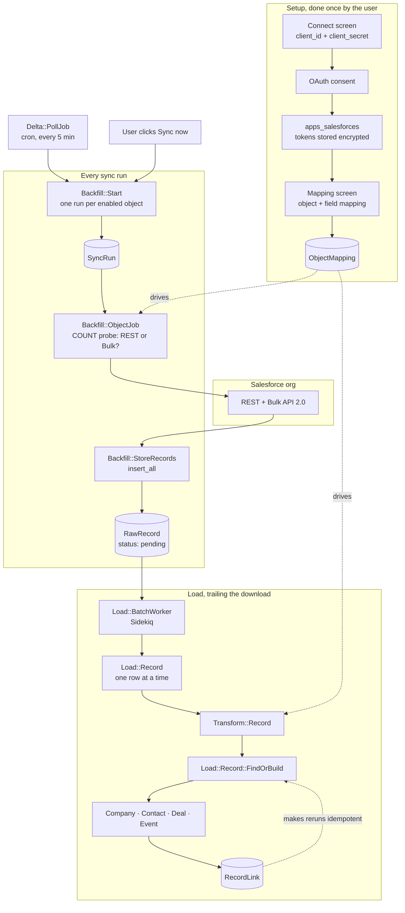
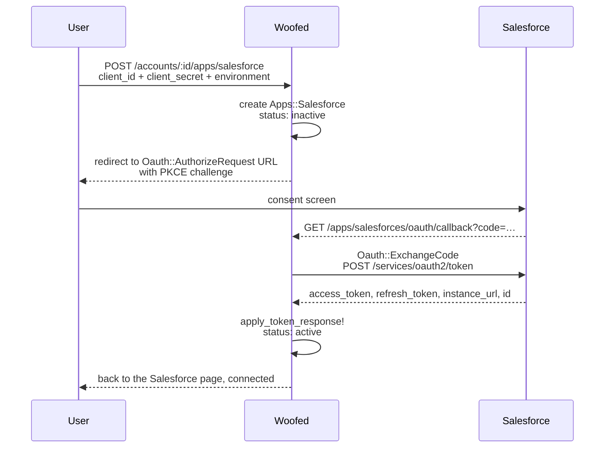
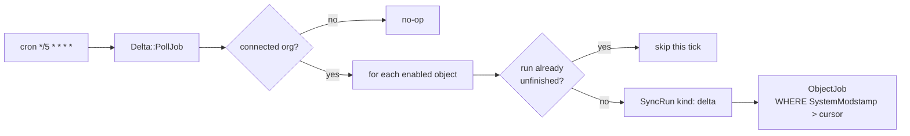
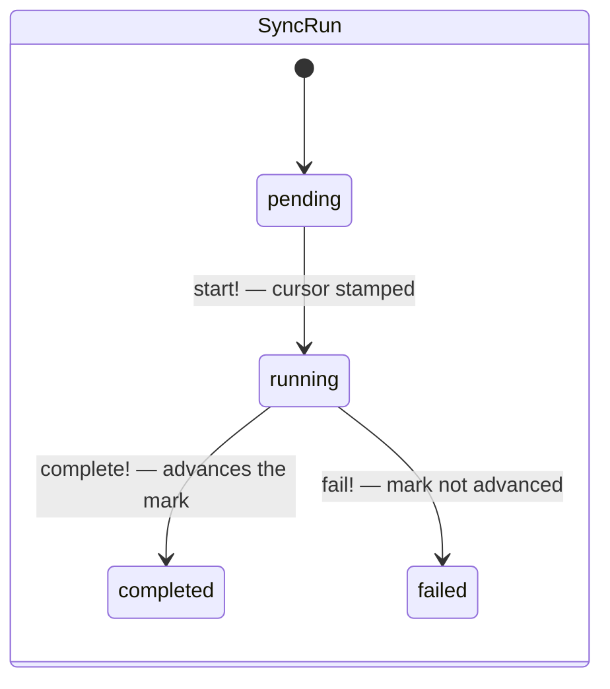
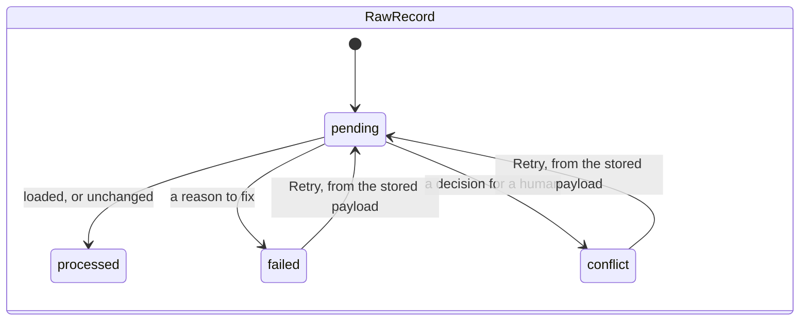

# Salesforce integration — how it works

A step-by-step walkthrough of the Salesforce ↔ Woofed sync as it exists in the code today, from
the OAuth handshake to the moment a Salesforce Account becomes a Woofed Company.

**Phase 1 is one-way: Salesforce → Woofed.** Nothing is written back to Salesforce. The only
outbound calls are reads (`describe`, SOQL, Bulk) plus the OAuth token endpoints.

For the design rationale, the alternatives that were rejected, and the stages still to build, see
[plan/plan.md](plan/plan.md) and the per-stage notes beside it. Section 10 below lists what is
**not** implemented yet and links each gap to its stage.

---

## 1. The pieces

Everything lives under `Apps::Salesforce`. Five tables, and a set of plain classes around them.

### Tables

| Model | Table | Holds |
|---|---|---|
| [Apps::Salesforce](../../../app/models/apps/salesforce.rb) | `apps_salesforces` | The connection: OAuth credentials, `instance_url`, `organization_id`, status. At most one row per install |
| [ObjectMapping](../../../app/models/apps/salesforce/object_mapping.rb) | `apps_salesforce_object_mappings` | **Configuration**, written by the user: "Opportunity becomes a Deal, and `Amount` feeds `total_amount_in_cents`" |
| [SyncRun](../../../app/models/apps/salesforce/sync_run.rb) | `apps_salesforce_sync_runs` | One execution, for one object: bulk job id, download locator, cursor, counters |
| [RawRecord](../../../app/models/apps/salesforce/raw_record.rb) | `apps_salesforce_raw_records` | The row exactly as Salesforce sent it, staged before any mapping is applied |
| [RecordLink](../../../app/models/apps/salesforce/record_link.rb) | `apps_salesforce_record_links` | The identity map: Salesforce `001Hn…` ⇄ Company #42 |

The distinction that matters most: **`ObjectMapping` is configuration** (a handful of rows,
answering *how do I translate?*) and **`RecordLink` is data** (hundreds of thousands of rows,
answering *which Woofed record is this?*).

### Supporting classes

| Namespace | Role |
|---|---|
| `Oauth::*`, `Connection::*` | Consent URL, code exchange, token refresh, revocation |
| `Api::*` | The single Faraday client, SOQL paging, Bulk API 2.0 jobs, `describe` |
| `Backfill::*` | Deciding what to download and writing it into staging |
| `Transform::*` | Turning a raw payload into Woofed attributes, and detecting conflicts |
| `Load::*` | Turning staged rows into Woofed records and linking them |
| [RecordId](../../../app/models/apps/salesforce/record_id.rb) | Normalises every Salesforce id to its 18-character form |
| [WoofedFields](../../../app/models/apps/salesforce/woofed_fields.rb) | The Woofed side of the field pickers: columns + custom attribute definitions |

---

## 2. The whole thing on one page



Two properties this shape buys, and both are load-bearing:

1. **Raw payloads are persisted before mapping.** Changing a field mapping re-runs the transform
   from staging instead of re-downloading the org. API calls are the customer's metered resource.
2. **The load is keyed on a link table, not a jsonb attribute.** That is what makes re-running any
   job safe, and what makes "which Woofed record is this Salesforce record?" an indexed lookup.

---

## 3. Step 1 — Connecting an org

The customer creates an **External Client App** in their own Salesforce org by hand — Woofed never
provisions it, because a self-hosted install lives on an arbitrary domain that no Woofed-owned app
could register as a redirect URI. The Connect screen is therefore also documentation: it shows the
exact callback URL for this install and the required scopes (`api`, `refresh_token offline_access`),
both with copy buttons.



What the code does with the response, in [TokenManagement](../../../app/models/concerns/apps/salesforce/token_management.rb):

- `client_secret`, `access_token` and `refresh_token` are `encrypts`-ed. A database dump alone does
  not yield a working credential.
- `instance_url` becomes the API base from then on — never `login.salesforce.com`.
- `organization_id` is parsed out of the `id` field, so re-pointing at a different org is detectable.
- `token_expires_at` is an **estimate**: the response carries no `expires_in`, because the session
  length is set by the customer's org. A 2-hour assumption is stored, and the authoritative expiry
  signal remains a `401`.

Two background paths keep the connection honest:

- **[Connection::RefreshJob](../../../app/jobs/apps/salesforce/connection/refresh_job.rb)** runs daily.
  Nothing tells Woofed when a customer revokes the app, so the connection is exercised on a schedule
  and the failure surfaces as `status: error` before the next sync, rather than as records quietly
  going missing.
- **`before_destroy :revoke_refresh_token`** posts to `/services/oauth2/revoke` when the user
  disconnects. It is best-effort: a token Salesforce already invalidated must not block the
  disconnect.

---

## 4. Step 2 — Mapping objects and fields

Nothing syncs until the user saves a mapping, so an accidental connect never floods the CRM.

The mapping screen is fed by two sources:

- **Salesforce side** — `/sobjects/<Object>/describe`, through
  [Api::Sobject::Describe](../../../app/models/apps/salesforce/api/sobject/describe.rb). The payload
  is hundreds of KB and changes rarely, so it is `Rails.cache`-d; failures are never cached.
- **Woofed side** — [WoofedFields](../../../app/models/apps/salesforce/woofed_fields.rb): the real
  columns of the target model plus the install's `CustomAttributeDefinition`s. Custom fields matter
  because a Salesforce custom field has no column to land in — `Industria__c` can only become
  `custom_attributes['industria']`.

An `ObjectMapping` row ends up looking like this:

```
salesforce_object: "Opportunity"
woofed_model:      "Deal"
enabled:           true
field_mappings:    [ { "salesforce_field": "Name",   "woofed_field": "name",  "kind": "attribute" },
                     { "salesforce_field": "Amount", "woofed_field": "total_amount_in_cents",
                       "kind": "attribute", "transform": "currency_to_cents" },
                     { "salesforce_field": "Industria__c", "woofed_field": "industria",
                       "kind": "custom_attribute" } ]
options:           { … }
```

`options` carries everything that does not fit a flat field pair. The keys the code actually reads:

| Key | Read by | Meaning |
|---|---|---|
| `stage_field` | [DealFields](../../../app/models/concerns/apps/salesforce/object_mapping/deal_fields.rb) | Which field holds the stage. Defaults to `StageName` |
| `company_field` | idem | Which lookup points at the company. Defaults to `AccountId` |
| `contact_field` | idem | Which field points at the contact. **No default** — an Opportunity relates to people through `OpportunityContactRole`, so only the user can name a lookup if their org has one |
| `stage_map` | [Deals::FindStage](../../../app/models/apps/salesforce/load/deals/find_stage.rb) | `"Prospecting" → stage_id` |
| `default_stage_id` | idem | Fallback for an unmapped stage value |
| `create_placeholder_contact` | [Deals::FindContact](../../../app/models/apps/salesforce/load/deals/find_contact.rb) | Opt-in. Off by default, because inventing contacts pollutes the CRM |
| `kind` | [Events::Prepare](../../../app/models/apps/salesforce/load/events/prepare.rb) | Which Woofed activity kind a Task/Event becomes |
| `country_code` | [Transform::Phone](../../../app/models/apps/salesforce/transform/phone.rb) | Default country for E.164 normalisation |
| `filter` | [Backfill::Soql](../../../app/models/apps/salesforce/backfill/soql.rb) | Optional SOQL `WHERE` fragment, e.g. only the last two years |

`stage_field`, `company_field` and `contact_field` exist because a **custom object** mapped onto
`Deal` names its own fields — one org calls the company `School__c`, another `Empresa__c`. Assuming
the standard names made every such row fail against fields the object never had.

---

## 5. Step 3 — A sync run

A run is started either by the user ("Sync now") or by the delta cron. Both go through
[Backfill::Start](../../../app/models/apps/salesforce/backfill/start.rb), which creates **one
`SyncRun` per enabled object** and enqueues an `ObjectJob` for each.

Objects are queued in dependency order — `Account → Contact → Lead → Opportunity → Task → Event` —
so an Opportunity finds the Account it belongs to already imported instead of creating a
placeholder for it. A custom object, which nothing else depends on, goes last.

An object with an unfinished run is **skipped, not queued twice**: a second run would create a
second bulk job on the org and download everything again.

### 5.1 Choosing how to download

```mermaid
flowchart TD
    A["Backfill::ObjectJob"] --> B["sync_run.start!<br/>status: running, cursor: now"]
    B --> C{"ObjectMapping<br/>still exists?"}
    C -->|no| D["sync_run.fail!<br/>mapping_missing"]
    C -->|yes| E["SELECT COUNT&#40;&#41; FROM Object<br/>one API call"]
    E --> F{"count ≥ 50,000?"}
    F -->|no| G["REST: Api::Query::AllPages"]
    F -->|yes| H["Bulk: Api::Bulk::Query::Create"]

    G --> G1["per page:<br/>StoreRecords + BatchWorker"]
    G1 --> G2["sync_run.complete!"]

    H --> H1["store bulk_job_id<br/>before anything else"]
    H1 --> H2["Backfill::PollJob"]
    H2 --> H3{"job state?"}
    H3 -->|"UploadComplete<br/>InProgress"| H4["reschedule with backoff<br/>10s → 30s → 1m → 2m → 5m"]
    H4 --> H2
    H3 -->|"Failed / Aborted"| H5["sync_run.fail!"]
    H3 -->|JobComplete| H6["Backfill::DownloadJob"]
    H6 --> H7["page + Sforce-Locator<br/>StoreRecords + BatchWorker"]
    H7 --> H8{"done?"}
    H8 -->|no| H9["save locator, re-enqueue"]
    H9 --> H6
    H8 -->|yes| H10["sync_run.complete!"]
```



**Why two strategies.** Below the threshold a paged REST query is simpler and finishes sooner: a
bulk job costs a create, several polls and a download round-trip before the first record arrives.
Above it, paging REST would spend one API call per 2,000 records against an allocation the customer
shares with every other integration they run. The `COUNT()` probe is a single call that picks the
cheaper path.

**Why the resumption state lives on the row.** `bulk_job_id` and `locator` are columns on `SyncRun`,
not job arguments. If the job that created the bulk job dies before scheduling the poll, a retry
sees the id and goes straight to polling instead of submitting a **second** bulk job. A download
that dies at 80% resumes from its locator.

**Why loading trails the download.** Both paths call `Load::BatchWorker` after every page rather
than at the end, so on a large object the first records are usable long before the last page
arrives.

### 5.2 The query itself

[Backfill::Soql](../../../app/models/apps/salesforce/backfill/soql.rb) builds the `SELECT`. SOQL has
no `SELECT *`, so every field has to be named:

```
SELECT Id, SystemModstamp, <relationship fields>, <fields the user mapped>
FROM <Object>
[WHERE SystemModstamp > <cursor> [AND <user filter>]]
ORDER BY SystemModstamp
```

- `Id` and `SystemModstamp` are always selected: one keys the record link, the other drives the
  cursor and the skip-if-unchanged check.
- **Relationship fields** come from the object's `describe`
  ([RelationshipFields](../../../app/models/apps/salesforce/backfill/relationship_fields.rb)), not
  from a fixed list, because a custom object has its own lookups and nobody can enumerate them in
  advance. Asking for a field the object does not have makes Salesforce reject the whole query.
- **Without a cursor it asks for everything** — that is the initial load. With one it asks only for
  what changed since.

### 5.3 Staging

[StoreRecords](../../../app/models/apps/salesforce/backfill/store_records.rb) writes the page with
`insert_all`: a bulk page carries ten thousand records and nothing here needs callbacks — these are
raw payloads, not Woofed records yet. Each row is stored with its id normalised to 18 characters and
`status: pending`.

---

## 6. Step 4 — Loading one row

[Load::BatchWorker](../../../app/models/apps/salesforce/load/batch_worker.rb) (Sidekiq) walks the
run's `pending` rows and hands each to [Load::Record](../../../app/models/apps/salesforce/load/record.rb)
**individually** — one bad record costs one row rather than the batch.

```mermaid
flowchart TD
    A["Load::Record.new&#40;raw_record&#41;"] --> B{"ObjectMapping<br/>exists?"}
    B -->|no| Z1["mark_failed!<br/>mapping_missing"]
    B -->|yes| C["Transform::Record<br/>payload → attributes"]
    C --> D["FindOrBuild"]

    D --> D1{"RecordLink<br/>exists?"}
    D1 -->|yes| D2["that record — update it"]
    D1 -->|no| D3{"email matches?"}
    D3 -->|yes| D4["adopt that record"]
    D3 -->|no| D5{"phone matches?"}
    D5 -->|yes| D4
    D5 -->|no| D6["model.new"]

    D2 --> E["Transform::Conflict"]
    D4 --> E
    D6 --> E
    E -->|"a different record<br/>owns the email/phone"| Z2["mark_conflict!<br/>a human decides"]
    E -->|clear| F{"link exists and<br/>SystemModstamp unchanged?"}

    F -->|yes| Z3["mark_processed!<br/>nothing written"]
    F -->|no| G["assign attributes<br/>merge custom/additional jsonb"]
    G --> H{"unknown columns<br/>in the mapping?"}
    H -->|yes| Z4["mark_failed!<br/>names the fields to fix"]
    H -->|no| I{"Deal or Event?"}
    I -->|yes| J["Deals::Prepare / Events::Prepare<br/>stage, pipeline, contact, company"]
    I -->|no| K["save!"]
    J -->|"cannot resolve"| Z5["mark_failed!<br/>with the reason"]
    J --> K
    K --> L["upsert_link<br/>RecordLink + modstamp + synced"]
    L --> Z6["mark_processed!"]
```



Every path ends with the staged row marked, so nothing is silently lost. The four outcomes are the
`status` values on `RawRecord`: `processed`, `failed`, `conflict`, or still `pending`.

### 6.1 The three ways to find the target record

```
record link exists?     → that record, update it
email or phone matches? → adopt that record, and link it from now on
neither                 → a new record
```

The middle case is what keeps a first sync from duplicating half the CRM: someone the sales team
added by hand last week is the same person Salesforce is now sending, and `contacts` has a unique
index on `lower(email)`, so creating a second one would fail on insert anyway. Email is matched
before phone — a number may be the company switchboard, while an email identifies a person.

### 6.2 Conflicts are decisions, not errors

Woofed enforces uniqueness that Salesforce does not. A Salesforce org happily holds thousands of
contacts sharing `info@company.com`. [Transform::Conflict](../../../app/models/apps/salesforce/transform/conflict.rb)
detects that **before** the insert and marks the row `conflict` with the reason and the record that
already owns the value — a listed decision a human can resolve, instead of a support ticket saying
"some contacts are missing".

A conflict is deliberately not retried automatically. The sync screen lists these rows with a
**Retry** button that re-runs the load from the **stored payload** and never calls Salesforce.

### 6.3 Values that will not convert do not lose the record

[Transform::Record](../../../app/models/apps/salesforce/transform/record.rb) runs each mapped field
through a named transform (`currency_to_cents`, `phone`, `datetime`, `picklist_to_label_list`, …),
inferred from the target column when the mapping does not name one. A value that cannot be
converted is reported as a warning and the original is kept under
`additional_attributes['salesforce_<field>_raw']` — a contact with an unusable phone number is
still worth importing.

Two details worth knowing:

- **A field Salesforce did not send is left alone; a field it sent empty is written.** Conflating
  the two would let a partial update wipe the rest of the record — which matters now for retries
  and will matter more when CDC events, which only carry changed fields, arrive.
- **The Salesforce id is mirrored into `additional_attributes['salesforce_id']`**, so it stays
  visible in the record detail UI and searchable, the way `chatwoot_id` already is. The link table
  remains the source of truth.

---

## 7. Step 5 — Staying current

Salesforce sends nothing on its own until CDC/webhooks are built, so freshness is bought by asking.
[Delta::PollJob](../../../app/jobs/apps/salesforce/delta/poll_job.rb) runs from the GoodJob cron in
[config/initializers/good_job.rb](../../../config/initializers/good_job.rb) every **5 minutes** and
calls the same `Backfill::Start`, with `kind: 'delta'`.



### The cursor is stamped at submission, not at the end

This is the subtle part, and getting it wrong loses records permanently.

`SyncRun#start!` sets `cursor: Time.current` when the run **begins**. Not at the end, and not from
the newest record downloaded. The reason:

> A download can run for an hour. A record edited *during* that hour was already fetched with its
> old values — and its new `SystemModstamp` can still be older than the newest row of the run. A
> cursor taken from the data would skip that record forever.

Starting the next run slightly in the past only costs re-reading a few records, which the load
ignores as unchanged via `RecordLink#outdated?`.

And only a **completed** run advances the mark: `SyncRun.last_cursor` filters on `completed`, so
finishing a partial run would silently skip everything it did not get to.

The same property means there is **no gap between backfill and delta**: a backfill also stamps a
cursor, so the first delta continues from where the initial load began.

---

## 8. State machines





`RecordLink` has a `sync_status` of its own (`pending` / `synced` / `failed`) plus `deleted_at`.
`tombstone!` is what a delete sweep will call: the Salesforce record is gone, the Woofed one stays,
along with whatever the user built on top of it.

---

## 9. Cross-cutting concerns

### Every call goes through one client

[Api::Client](../../../app/models/apps/salesforce/api/client.rb) is the only place that knows about
the bearer token. Each endpoint is its own small class that delegates to it, so none of them repeats:

- **Refresh-and-retry on `401`.** A 401 means the session died earlier than `token_expires_at`
  predicted, which is expected. The client refreshes with `force: true` and replays the request
  exactly once.
- **Undecryptable credentials.** A rotated `SECRET_KEY_BASE` leaves the stored tokens unreadable.
  That is the same dead end as a revoked app, so it lands in the same state: `status: error`,
  reconnect.
- **Transport retries.** Timeouts and connection failures retry three times with jittered backoff.
- **PII-safe logging.** Record ids and counts only — never bodies. Salesforce payloads are PII.

Every method returns the same shape — `{ ok: … }` or `{ error: … }` — which is why the callers read
as straight-line code with no `rescue` scattered through them.

### Concurrency

`ObjectJob` uses `GoodJob::ActiveJobExtensions::Concurrency` with `perform_limit: 1` keyed on the
run id, so the same run can never be processed twice in parallel. At the level above,
`Backfill::Start` skips objects that already have an unfinished run.

### Which engine runs what

| Job | Engine | Trigger |
|---|---|---|
| `Backfill::ObjectJob`, `PollJob`, `DownloadJob` | GoodJob | Fan-out from `Backfill::Start` |
| `Delta::PollJob` | GoodJob cron | `*/5 * * * *` |
| `Connection::RefreshJob` | GoodJob cron | `0 12 * * *` |
| `Load::BatchWorker` | Sidekiq | After every downloaded page |

Long-running and scheduled work is GoodJob; the short per-batch load is Sidekiq — the split
`AGENTS.md` asks for.

---

## 10. What is not implemented yet

Everything below is described in [plan/plan.md](plan/plan.md) but has no code behind it. Ordered by
how much it will hurt in production.

### 10.1 The import guard — **stage 2, blocking**

`Contact` fires `after_commit :export_contact_to_chatwoot` on create and update, gated only on
`skip_validation`. The Salesforce loader does **not** set that flag, and there is no
`Current.sync_source`-style gate.

**Consequence today:** on an install that also has Chatwoot configured, importing 50,000 Salesforce
contacts pushes all 50,000 into the customer's Chatwoot account. `Deal` and `Event` broadcasts,
webhooks and webpush notifications have the same exposure.

Using the existing `skip_validation` is not the fix — it also disables the email/phone validations,
which is exactly what an import must keep. The plan calls for an explicit flag that suppresses the
**outbound side effects only**. See [plan/plan.md §8.2](plan/plan.md).

### 10.2 Deletes — stage 14

A deleted Salesforce record simply stops appearing in query results, so today it lives on in Woofed
forever. The pieces are already in place and unused:

- `Api::Query::Page` and `Api::Bulk::Query::Create` both take `include_deleted`, which switches them
  to `queryAll` — nothing passes it.
- `RecordLink#tombstone!` and the `active` scope exist — nothing calls them.

What is missing is the sweep that runs `queryAll` for `IsDeleted = true` per object per tick and
tombstones the matching links. Soft-mark, never hard-delete: the Woofed record may have accumulated
deals, events and notes the user does not want to lose.

### 10.3 Converted Leads — plan §9.4

`IsConverted` is selected into the payload by `RelationshipFields`, but nothing reads it. A converted
Lead therefore produces one Woofed contact from the Lead **and** another from the Contact it became.
The fix is to follow `ConvertedContactId` and point both Salesforce ids at the single Woofed contact
— which the link table already supports, since it is keyed on `(object, id)` precisely so that
`Contact` and `Lead` can both map onto a Woofed `Contact`.

### 10.4 Merges — plan §9.5

A Salesforce merge leaves the losing id dangling with `MasterRecordId` pointing at the survivor.
Nothing reads it. Handle it as a delete-with-redirect: repoint the link row at the surviving record.

### 10.5 `User` / owner mapping — plan §6.3

`ObjectMapping::WOOFED_MODELS` is `Company`, `Contact`, `Deal`, `Event`. There is no `User` target,
so `OwnerId` is never resolved into `deal_assignees` or `created_by_id`. The plan's rule is
**match by email only, never create**, leaving unmatched owners blank. Plan §14.2 still lists the
alternative (assign to a default user) as an open question.

### 10.6 Auto-creating custom attribute definitions — plan §6.3

`WoofedFields` lists the `CustomAttributeDefinition`s that already exist; it does not create one.
A Salesforce custom field can only be mapped if someone defined the matching Woofed custom attribute
by hand first.

### 10.7 Mapping validation at save time — plan §7

The plan asks for incompatible mappings to be rejected when saved. Today an impossible mapping is
only discovered at load time, per row: `Load::Record` reports the row with the field names to fix
(which is why it does not take the batch down), but the user finds out during the sync rather than
on the mapping screen.

### 10.8 Hardening — stage 16

No rate-limit backoff on Salesforce's `REQUEST_LIMIT_EXCEEDED`, and no API-usage telemetry from the
`Sforce-Limit-Info` response header. Both matter because the allocation being spent is the
customer's, shared with every other integration in their org.

### 10.9 A stuck-run sweeper — not in the plan

Found while wiring the delta cron, and worth recording. `Backfill::Start` skips an object that has a
`pending`/`running` run. If a worker dies mid-run the row stays `running` forever, and that object
**stops syncing permanently** — silently, since the cron keeps firing and keeps skipping it.

Nothing expires a stale run today. With a manual sync button this was rare; with a 5-minute cron it
is a matter of when. The fix is a sweeper that fails runs whose `started_at` is older than some
ceiling, so the next tick picks the object up again.

### 10.10 Phase 2

CDC via the Pub/Sub API (stage 18) and write-back (stage 19). Both are deliberately out of phase 1.
The three decisions that keep them cheap are already taken: the link table is bidirectional by
construction, field mappings are declarative so an inverse mapper can reuse them, and
`salesforce_system_modstamp` sits next to Woofed's `updated_at` for last-write-wins.

---

## 11. Where to look for what

| Question | File |
|---|---|
| How is the consent URL built? | [oauth/authorize_request.rb](../../../app/models/apps/salesforce/oauth/authorize_request.rb) |
| Where is the 401 retry? | [api/client.rb](../../../app/models/apps/salesforce/api/client.rb) |
| Why did my query not include a field? | [backfill/soql.rb](../../../app/models/apps/salesforce/backfill/soql.rb) + [relationship_fields.rb](../../../app/models/apps/salesforce/backfill/relationship_fields.rb) |
| Why was this row skipped? | [load/record.rb](../../../app/models/apps/salesforce/load/record.rb) |
| Why did a Deal fail? | [load/deals/prepare.rb](../../../app/models/apps/salesforce/load/deals/prepare.rb) |
| How is a stage resolved? | [load/deals/find_stage.rb](../../../app/models/apps/salesforce/load/deals/find_stage.rb) |
| What does the sync screen read? | [salesforces_controller.rb](../../../app/controllers/inertia/accounts/apps/salesforces_controller.rb) + [Show.tsx](../../../app/javascript/pages/Apps/Salesforce/Show.tsx) |
| Why are there two ids for one record? | [record_id.rb](../../../app/models/apps/salesforce/record_id.rb) |
