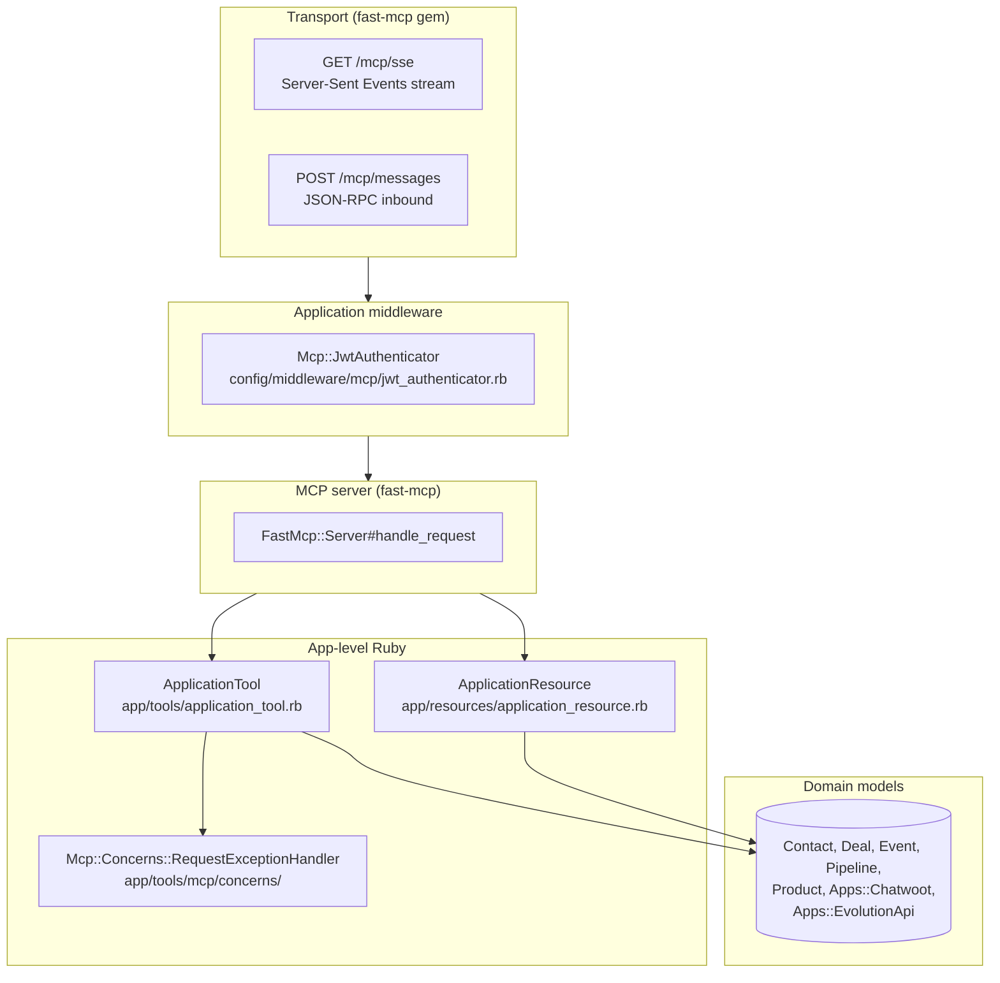
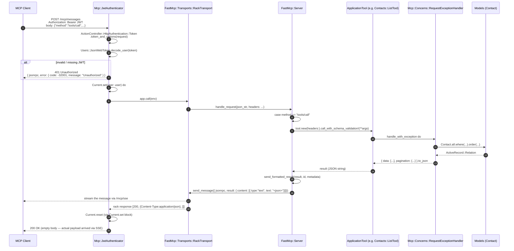
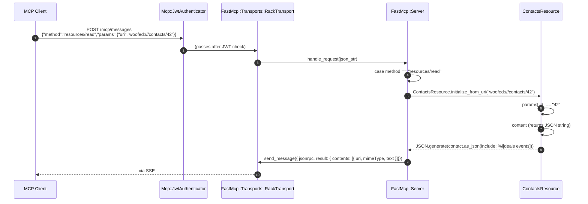
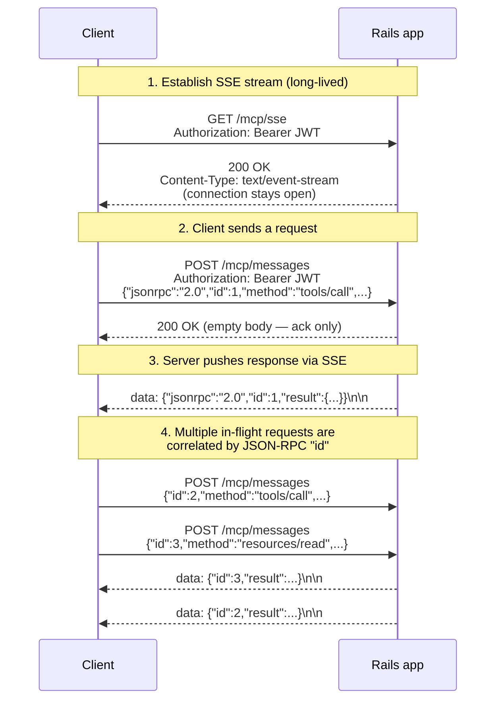
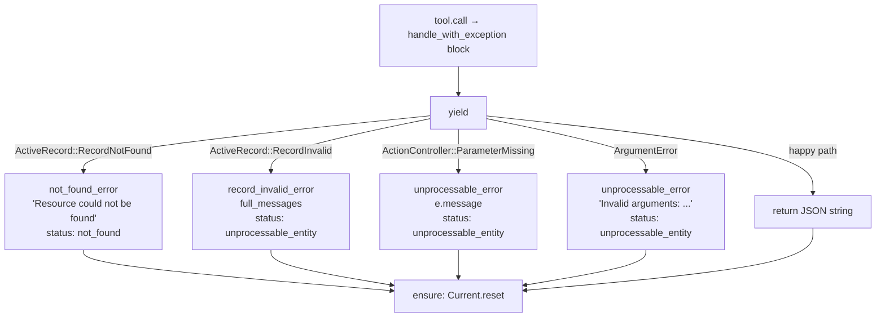

# Architecture

This document describes the architecture of the Woofed CRM MCP server: how the layers fit together, how an HTTP request flows from the client to a tool/resource, and how the SSE transport delivers responses.

---

## Table of contents

1. [Layers](#layers)
2. [Middleware stack](#middleware-stack)
3. [Request lifecycle — Tools](#request-lifecycle--tools)
4. [Request lifecycle — Resources](#request-lifecycle--resources)
5. [SSE transport in depth](#sse-transport-in-depth)
6. [Error handling](#error-handling)
7. [File layout](#file-layout)

---

## Layers

The MCP integration is split into clearly separated layers. Each layer has a single responsibility:



| Layer | Responsibility |
|---|---|
| **Transport** | HTTP + SSE wire protocol. JSON-RPC framing. Provided by `fast-mcp`. |
| **Middleware** | JWT validation, sets `Current.user`, short-circuits unauthorized requests with `401`. |
| **MCP server** | Routes the JSON-RPC method (`tools/call`, `resources/read`, etc.) to the right handler. |
| **App-level Ruby** | Business logic. Tools/resources call into models, builders, and use cases. |
| **Domain models** | ActiveRecord models. Same models used by the REST API and the web UI. |

---

## Middleware stack

The Rails middleware stack, ordered top-down (request flow), looks like this after our initializer runs:

```
…
Rack::Runtime
ActionDispatch::Executor
ActionDispatch::Static
…
Mcp::JwtAuthenticator             ← inserted by config/initializers/fast_mcp.rb
FastMcp::Transports::RackTransport
…
Routes (Rails router, never reached for /mcp/*)
```

Two things to note:

1. **`Mcp::JwtAuthenticator` is inserted via `insert_before`**, ensuring it runs *before* `FastMcp::Transports::RackTransport`:

    ```ruby
    Rails.application.config.middleware.insert_before(
      FastMcp::Transports::RackTransport,
      Mcp::JwtAuthenticator,
      path_prefix: '/mcp'
    )
    ```

2. **The middleware class is `require`d explicitly** at the top of the initializer because it lives outside Rails' autoload paths (in `config/middleware/`):

    ```ruby
    require Rails.root.join('config/middleware/mcp/jwt_authenticator').to_s
    ```

    This avoids a chicken-and-egg problem: Zeitwerk's main loader isn't fully set up by the time `config/initializers/*.rb` runs, so referencing an autoload-only constant from the initializer fails. Placing the file in `config/middleware/` (not autoloaded) and `require`ing it makes the constant available immediately.

---

## Request lifecycle — Tools

A typical tool call goes through the following sequence:



**Why does the POST return an empty body?** The legacy MCP HTTP+SSE transport (which fast-mcp implements) sends the actual response over the SSE channel — not in the POST response. The POST `/mcp/messages` simply acknowledges receipt with `200 OK`. The client reads the response from its open `GET /mcp/sse` stream.

This split has direct implications for testing — see [testing.md](testing.md#why-tests-stub-send_message).

---

## Request lifecycle — Resources

Resources follow a similar flow but use a different JSON-RPC method (`resources/read`):



Resources use `contents` (plural) instead of `content`, per the MCP spec.

---

## SSE transport in depth

The full picture of how request/response interleave on the wire:



Implementation notes:

- The SSE stream is implemented in [`FastMcp::Transports::RackTransport`](https://github.com/yjacquin/fast-mcp/blob/main/lib/mcp/transports/rack_transport.rb), specifically `handle_sse_request` and `setup_sse_connection`. Rack hijacking is used to keep the connection open.
- The server keeps a `@sse_clients` map of connected streams. When a tool/resource finishes, `send_message(message)` writes `data: <json>\n\n` to every connected stream.
- If no SSE client is connected (as in `Rack::Test`), `send_message` writes to nothing — the response is dropped. That's why the test suite stubs `send_message` (see [testing.md](testing.md)).

---

## Error handling

Exceptions raised inside a tool are caught by `Mcp::Concerns::RequestExceptionHandler` (included in `ApplicationTool`). The pattern mirrors `Api::Concerns::RequestExceptionHandler` from the REST API, but returns JSON strings instead of rendering HTTP responses.



All branches converge on `ensure: Current.reset` so that thread-local state doesn't leak between requests on the same thread (relevant for multi-threaded Puma).

Return shapes:

| Helper | Shape |
|---|---|
| `not_found_error('msg')` | `{ "error": "msg", "status": "not_found" }` |
| `unprocessable_error(msg)` | `{ "error": msg, "status": "unprocessable_entity" }` |
| `record_invalid_error(e)` | `{ "error": [...full_messages], "attributes": [...], "status": "unprocessable_entity" }` |

`msg` may be a string or an array. Arrays are typically `record.errors.full_messages`.

---

## File layout

```
woofed-crm/
├── config/
│   ├── initializers/
│   │   └── fast_mcp.rb              ← mounts MCP, inserts middleware
│   └── middleware/
│       └── mcp/
│           └── jwt_authenticator.rb ← Rack middleware (NOT autoloaded)
├── app/
│   ├── tools/
│   │   ├── application_tool.rb      ← base class, paginate helper
│   │   ├── mcp/
│   │   │   └── concerns/
│   │   │       └── request_exception_handler.rb
│   │   ├── contacts/
│   │   │   ├── list_tool.rb
│   │   │   ├── create_tool.rb
│   │   │   └── update_tool.rb
│   │   ├── deals/
│   │   │   ├── list_tool.rb
│   │   │   ├── create_tool.rb
│   │   │   ├── update_tool.rb
│   │   │   ├── mark_won_tool.rb
│   │   │   └── mark_lost_tool.rb
│   │   ├── pipelines/list_tool.rb
│   │   ├── products/list_tool.rb
│   │   ├── events/
│   │   │   ├── create_note_tool.rb
│   │   │   ├── create_activity_tool.rb
│   │   │   ├── send_chatwoot_message_tool.rb
│   │   │   └── send_whatsapp_message_tool.rb
│   │   └── apps/
│   │       ├── chatwoots/list_tool.rb
│   │       └── evolution_apis/list_tool.rb
│   ├── resources/
│   │   ├── application_resource.rb  ← base class
│   │   ├── contacts_resource.rb
│   │   ├── deals_resource.rb
│   │   └── products_resource.rb
│   └── models/
│       └── current.rb               ← Current.user added here
├── spec/
│   ├── support/
│   │   └── mcp_request_helpers.rb   ← test stub for SSE
│   ├── middleware/mcp/
│   ├── tools/
│   └── resources/
└── docs/
    └── mcp/                         ← this folder
```

The split between `config/middleware/` (manually `require`d) and `app/tools/` (autoloaded by Zeitwerk) is intentional — see [authentication.md § Loading the middleware](authentication.md#loading-the-middleware) for the rationale.
