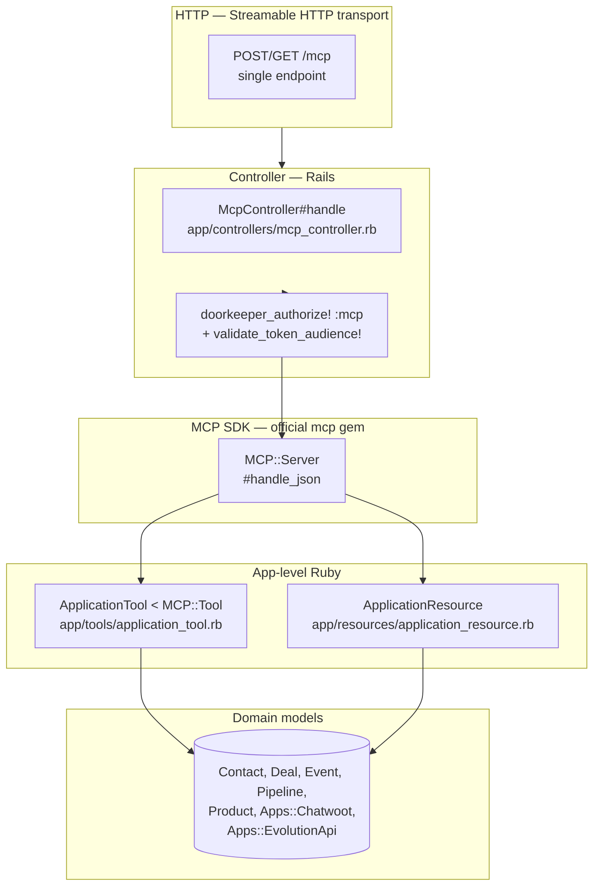
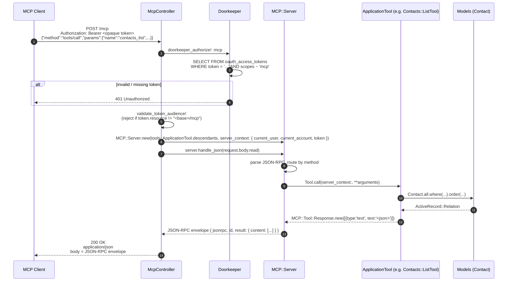
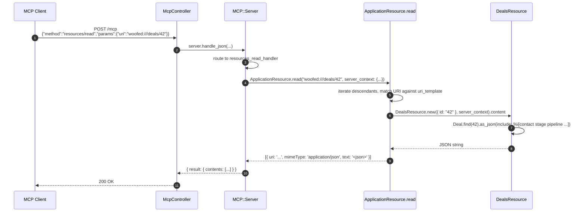

# Architecture

This document describes the architecture of the Woofed CRM MCP server: how the layers fit together, how an HTTP request flows from the client through `McpController` into a tool/resource, and how the Streamable HTTP transport returns responses.

---

## Table of contents

1. [Layers](#layers)
2. [Transport](#transport)
3. [Request lifecycle — Tools](#request-lifecycle--tools)
4. [Request lifecycle — Resources](#request-lifecycle--resources)
5. [Error handling](#error-handling)
6. [File layout](#file-layout)

---

## Layers

The MCP integration is split into clearly separated layers, each with a single responsibility:



| Layer | Responsibility |
|---|---|
| **Transport** | A single `/mcp` endpoint per the MCP 2025-06-18 Streamable HTTP spec. POST handles JSON-RPC requests; GET is reserved for server-initiated streams (unused today). |
| **Controller** | `McpController` runs `doorkeeper_authorize!` and validates the token's `resource` claim before delegating to the SDK. |
| **SDK (`mcp` gem)** | [Official Model Context Protocol Ruby SDK](https://github.com/modelcontextprotocol/ruby-sdk). Parses JSON-RPC, dispatches to tools/resources, formats responses. |
| **App-level Ruby** | Business logic. Tools/resources call into models, builders, and use cases. |
| **Domain models** | ActiveRecord models. Same models used by the REST API and the web UI. |

---

## Transport

Streamable HTTP is a single-endpoint design:

| Method | Use |
|---|---|
| `POST /mcp` | JSON-RPC requests (`initialize`, `tools/call`, `resources/read`, …) and notifications (`notifications/initialized`). The response body is the JSON-RPC reply. |
| `GET /mcp` | Reserved for server-initiated streaming (SSE upgrade). Hits the same controller. Not used today — clients drive everything via POST. |

There is no separate `/mcp/sse` or `/mcp/messages` like the legacy SSE transport — the response travels in the POST body. This is what Claude Web, Claude Code remote MCP, Cursor, and ChatGPT custom connectors all expect.

Routes are declared in [config/routes.rb](../../config/routes.rb):

```ruby
post '/mcp', to: 'mcp#handle'
get  '/mcp', to: 'mcp#handle'
```

---

## Request lifecycle — Tools

A typical tool call goes through:



**No SSE.** Unlike the legacy transport, the response travels in the same HTTP response body. The POST returns 200 with the full JSON-RPC reply.

The only exception is `notifications/initialized`: it has no `id`, expects no reply, and the controller short-circuits to `head :accepted` (204-style 202).

---

## Request lifecycle — Resources

Resources use URI templates (e.g. `woofed:///deals/{id}`). Since `MCP::ResourceTemplate` is metadata-only, dispatching reads is done via a per-request handler block in `McpController`:



Templates are registered with the server via the `resource_templates:` constructor parameter; reads are dispatched via `server.resources_read_handler { |params| ApplicationResource.read(params[:uri], ...) }`. See [adding-resources.md](adding-resources.md) for the DSL.

---

## Error handling

Exceptions raised inside a tool are caught by `ApplicationTool.handle_errors` — defined in [app/tools/application_tool.rb](../../app/tools/application_tool.rb). Unlike the old JSON-shaped error responses, all error branches now return **plain text** wrapped in `MCP::Tool::Response`, which is what LLMs read better.

```mermaid
flowchart TD
    Call[Tool.call --> handle_errors block] --> Yield[yield]
    Yield -->|happy path| Ok["json_response(payload)<br/>= text response with JSON body"]
    Yield -->|ActiveRecord::RecordNotFound| NF["text_response(\"Couldn't find ...\")"]
    Yield -->|ActiveRecord::RecordInvalid| RI["text_response(\"Validation failed: ...\")"]
    Yield -->|StandardError| GE["text_response(\"An error occurred: ...\")"]
```

For resources, `ApplicationResource.read` also catches `ActiveRecord::RecordNotFound` and returns the message as a `text/plain` content item, so the client sees `"Couldn't find Contact with 'id'=99999"` instead of a generic JSON-RPC internal error.

---

## File layout

```
woofed-crm/
├── config/
│   ├── routes.rb                    ← `post '/mcp', to: 'mcp#handle'` + OAuth routes
│   └── initializers/
│       ├── doorkeeper.rb            ← OAuth 2.1 config (PKCE, scopes, resource indicators)
│       └── mcp.rb                   ← preloads tools + resources, defines MCP::EmptyProperty
├── app/
│   ├── controllers/
│   │   ├── mcp_controller.rb        ← single entry point for /mcp
│   │   └── oauth/
│   │       ├── client_registrations_controller.rb  ← RFC 7591 DCR
│   │       └── metadata_controller.rb              ← RFC 8414 + RFC 9728 well-known
│   ├── tools/
│   │   ├── application_tool.rb      ← base < MCP::Tool, helpers (paginate, current_user, …)
│   │   ├── contacts/
│   │   │   ├── list_tool.rb
│   │   │   ├── create_tool.rb
│   │   │   └── update_tool.rb
│   │   ├── deals/
│   │   │   ├── list_tool.rb
│   │   │   ├── create_tool.rb
│   │   │   ├── update_tool.rb
│   │   │   ├── mark_won_tool.rb
│   │   │   └── mark_lost_tool.rb
│   │   ├── pipelines/{list,create,update}_tool.rb
│   │   ├── stages/{list,create,update}_tool.rb
│   │   ├── products/list_tool.rb
│   │   ├── events/{create_note,create_activity,send_chatwoot_message,send_whatsapp_message}_tool.rb
│   │   └── apps/{chatwoots,evolution_apis}/list_tool.rb
│   ├── resources/
│   │   ├── application_resource.rb  ← URI template matcher + dispatcher
│   │   ├── contacts_resource.rb
│   │   ├── deals_resource.rb
│   │   ├── pipelines_resource.rb
│   │   └── products_resource.rb
│   └── views/
│       └── doorkeeper/
│           └── authorizations/new.html.erb  ← OAuth consent screen
├── spec/
│   ├── support/
│   │   └── mcp_request_helpers.rb   ← shared helpers (mcp_auth_headers, mcp_text, mcp_result)
│   ├── tools/                       ← one spec per tool
│   ├── resources/                   ← one spec per resource
│   └── requests/oauth/              ← OAuth flow specs
└── docs/
    └── mcp/                         ← this folder
```
