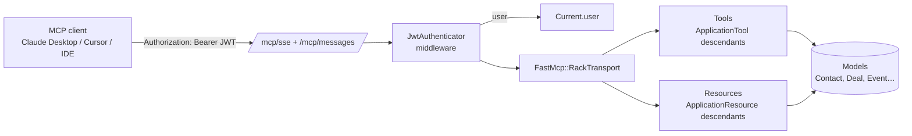

# MCP Server — Woofed CRM

Complete technical documentation for the **Model Context Protocol (MCP)** integration in Woofed CRM. This MCP server lets LLM clients (Claude Desktop, Cursor, MCP-capable IDEs, etc.) query and operate on CRM data through a typed API.

---

## Table of contents

1. [Overview](#overview)
2. [Stack](#stack)
3. [Exposed endpoints](#exposed-endpoints)
4. [Available tools](#available-tools)
5. [Available resources](#available-resources)
6. [Related documents](#related-documents)

---

## Overview

The Woofed CRM MCP server exposes the main business entities (Contacts, Deals, Pipelines, Products, Events, App integrations) as **tools** (callable functions) and **resources** (records readable by URI). All interaction happens over HTTP+SSE following the [Model Context Protocol specification](https://modelcontextprotocol.io).

**High-level flow:**



The LLM client receives a **per-user JWT** (generated via `Users::JsonWebToken.encode_user`) and configures it in `claude_desktop_config.json` (or equivalent). From there on, every call passes through the auth middleware, is dispatched by fast-mcp, and runs the tools/resources implemented in [app/tools/](../../app/tools/) and [app/resources/](../../app/resources/).

---

## Stack

| Component | Version | Purpose |
|---|---|---|
| [fast-mcp](https://github.com/yjacquin/fast-mcp) | `1.6.0` | Gem that implements the MCP protocol (server + SSE transport) |
| [dry-schema](https://dry-rb.org/gems/dry-schema/) | `~> 1.14` | Validation of tool arguments (transitive via fast-mcp) |
| Rails | `7.1.5.1` | Host for the MCP middleware |
| Devise + JWT | — | Access token generation/validation |
| Pagy | `~> 3.5` | Pagination on list tools |

The gem is declared in [Gemfile](../../Gemfile):

```ruby
gem 'fast-mcp', '1.6.0', require: 'fast_mcp'
```

> The `require: 'fast_mcp'` is required because the gem name (`fast-mcp`, with hyphen) does not match the internal require path (`fast_mcp`, with underscore). Without it, `Bundler.require` doesn't load the gem.

---

## Exposed endpoints

fast-mcp is mounted in Rails as a Rack middleware via [config/initializers/fast_mcp.rb](../../config/initializers/fast_mcp.rb):

```ruby
FastMcp.mount_in_rails(
  Rails.application,
  name: 'woofed-crm',
  version: '1.0.0',
  path_prefix: '/mcp',
  messages_route: 'messages',
  sse_route: 'sse',
  allowed_origins: ['localhost', '127.0.0.1', 'example.com', /.*\.example\.com/, ENV['FRONTEND_URL']].compact
) do |server|
  Rails.application.config.after_initialize do
    server.register_tools(*ApplicationTool.descendants)
    server.register_resources(*ApplicationResource.descendants)
  end
end
```

Two HTTP endpoints become available:

| Endpoint | Method | Purpose |
|---|---|---|
| `/mcp/sse` | `GET` | Opens the Server-Sent Events stream. Server → Client. |
| `/mcp/messages` | `POST` | Receives JSON-RPC requests from the client. Client → Server. |

The detailed SSE flow lives in [architecture.md](architecture.md).

---

## Available tools

Tools are functions the LLM can invoke. Each one lives in [app/tools/](../../app/tools/) and inherits from `ApplicationTool`.

| Tool | Description | Doc |
|---|---|---|
| `contacts_list` | List contacts with filters and pagination | [tools/contacts.md](tools/contacts.md) |
| `contacts_create` | Create a contact | [tools/contacts.md](tools/contacts.md) |
| `contacts_update` | Update a contact | [tools/contacts.md](tools/contacts.md) |
| `deals_list` | List deals with filters | [tools/deals.md](tools/deals.md) |
| `deals_create` | Create a deal | [tools/deals.md](tools/deals.md) |
| `deals_update` | Update a deal | [tools/deals.md](tools/deals.md) |
| `deals_mark_won` | Mark a deal as won | [tools/deals.md](tools/deals.md) |
| `deals_mark_lost` | Mark a deal as lost | [tools/deals.md](tools/deals.md) |
| `pipelines_list` | List pipelines with their stages | [tools/pipelines.md](tools/pipelines.md) |
| `products_list` | List catalog products | [tools/products.md](tools/products.md) |
| `events_create_note` | Add a note to a deal/contact | [tools/events.md](tools/events.md) |
| `events_create_activity` | Schedule an activity (call/meeting) | [tools/events.md](tools/events.md) |
| `events_send_chatwoot_message` | Send/schedule a Chatwoot message | [tools/events.md](tools/events.md) |
| `events_send_whatsapp_message` | Send/schedule a WhatsApp message (Evolution API) | [tools/events.md](tools/events.md) |
| `apps_chatwoots_list` | List available Chatwoot integrations | [tools/apps.md](tools/apps.md) |
| `apps_evolution_apis_list` | List available WhatsApp (Evolution API) integrations | [tools/apps.md](tools/apps.md) |

---

## Available resources

Resources are canonical reads by URI. Each one lives in [app/resources/](../../app/resources/) and inherits from `ApplicationResource`.

| URI template | Returns | Doc |
|---|---|---|
| `woofed:///contacts/{id}` | Contact + deals + events | [resources/contacts.md](resources/contacts.md) |
| `woofed:///deals/{id}` | Deal + contact + stage + pipeline + assignees + products | [resources/deals.md](resources/deals.md) |
| `woofed:///products/{id}` | Product + deal_products | [resources/products.md](resources/products.md) |

---

## Related documents

- 🏗️ [architecture.md](architecture.md) — Architecture, request flow, diagrams
- 🔐 [authentication.md](authentication.md) — JWT, middleware, token generation
- 🧪 [testing.md](testing.md) — How to test tools/resources (SSE stub, request specs)
- ➕ [adding-tools.md](adding-tools.md) — How to add a new tool
- ➕ [adding-resources.md](adding-resources.md) — How to add a new resource
