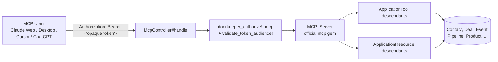

# MCP Server — Woofed CRM

Complete technical documentation for the **Model Context Protocol (MCP)** integration in Woofed CRM. This MCP server lets LLM clients (Claude Web custom connectors, Claude Desktop, Claude Code, Cursor, ChatGPT, MCP-capable IDEs, etc.) query and operate on CRM data through a typed API.

---

## Table of contents

1. [Overview](#overview)
2. [Stack](#stack)
3. [Exposed endpoints](#exposed-endpoints)
4. [Available tools](#available-tools)
5. [Available resources](#available-resources)
6. [Related documents](#related-documents)

---

## Overview

The Woofed CRM MCP server exposes the main business entities (Contacts, Deals, Pipelines, Products, Events, App integrations) as **tools** (callable functions) and **resources** (records readable by URI). All interaction happens over HTTP via the **Streamable HTTP transport** ([MCP spec 2025-06-18](https://modelcontextprotocol.io/specification/2025-06-18/basic/transports)).

**High-level flow:**



Clients authenticate with a **Bearer token** in the `Authorization` header. The token is either:

- **OAuth-issued** (Claude Web, Claude Code remote MCP, Cursor, ChatGPT) — the client goes through Dynamic Client Registration + the authorization code flow with PKCE. See [authentication.md](authentication.md) for the end-to-end OAuth dance.
- **Manually-issued** (Claude Desktop, agno, curl) — generated once via the Rails console as a `Doorkeeper::AccessToken` and pasted into the client config.

Both paths produce the same opaque token shape and pass through the same `doorkeeper_authorize!` check.

---

## Stack

| Component | Version | Purpose |
|---|---|---|
| [mcp](https://github.com/modelcontextprotocol/ruby-sdk) | `0.17.0` | Official Ruby SDK — MCP::Server, MCP::Tool, MCP::ResourceTemplate, Streamable HTTP transport |
| [doorkeeper](https://github.com/doorkeeper-gem/doorkeeper) | `5.9.1` | OAuth 2.1 authorization server (authorize, token, revoke). RFC 8707 Resource Indicators enabled. |
| [devise](https://github.com/heartcombo/devise) | (pre-existing) | User authentication used in the OAuth consent flow |
| Rails | `7.1.5.1` | Host framework |
| Pagy | `~> 3.5` | Pagination on list tools |

Declared in [Gemfile](../../Gemfile):

```ruby
gem 'mcp', '0.17.0'
gem 'doorkeeper', '5.9.1'
```

---

## Exposed endpoints

| Endpoint | Method | Purpose |
|---|---|---|
| `/mcp` | `POST` | JSON-RPC requests (`initialize`, `tools/call`, `resources/read`, …) and notifications. Response is in the body. |
| `/mcp` | `GET` | Reserved for server-initiated streams (Streamable HTTP). Currently routes to the same controller but isn't actively used. |
| `/oauth/authorize` | `GET`/`POST` | OAuth authorization endpoint (consent screen, PKCE required). |
| `/oauth/token` | `POST` | OAuth token endpoint (authorization_code + refresh_token grants). |
| `/oauth/register` | `POST` | RFC 7591 Dynamic Client Registration (rate-limited 10/h per IP). |
| `/.well-known/oauth-protected-resource` | `GET` | RFC 9728 metadata pointing to the authorization server. |
| `/.well-known/oauth-authorization-server` | `GET` | RFC 8414 metadata advertising OAuth endpoints + capabilities. |

The detailed flow lives in [architecture.md](architecture.md) and [authentication.md](authentication.md).

---

## Available tools

Tools are functions the LLM can invoke. Each lives in [app/tools/](../../app/tools/) and inherits from `ApplicationTool` (which inherits from `MCP::Tool`).

| Tool | Description | Doc |
|---|---|---|
| `contacts_list` | List contacts with filters and pagination | [tools/contacts.md](tools/contacts.md) |
| `contacts_create` | Create a contact | [tools/contacts.md](tools/contacts.md) |
| `contacts_update` | Update a contact | [tools/contacts.md](tools/contacts.md) |
| `deals_list` | List deals with filters | [tools/deals.md](tools/deals.md) |
| `deals_create` | Create a deal | [tools/deals.md](tools/deals.md) |
| `deals_update` | Update a deal | [tools/deals.md](tools/deals.md) |
| `deals_mark_won` | Mark a deal as won | [tools/deals.md](tools/deals.md) |
| `deals_mark_lost` | Mark a deal as lost | [tools/deals.md](tools/deals.md) |
| `deals_add_assignee` | Assign a user as responsible of a deal | [tools/deals.md](tools/deals.md) |
| `deals_remove_assignee` | Remove a user from a deal's assignees | [tools/deals.md](tools/deals.md) |
| `deals_add_product` | Attach a product (deal_product line) to a deal | [tools/deals.md](tools/deals.md) |
| `deals_update_product` | Update the quantity / unit price of a deal_product | [tools/deals.md](tools/deals.md) |
| `deals_remove_product` | Remove a product from a deal | [tools/deals.md](tools/deals.md) |
| `pipelines_list` | List pipelines with their stages | [tools/pipelines.md](tools/pipelines.md) |
| `pipelines_create` | Create a pipeline | [tools/pipelines.md](tools/pipelines.md) |
| `pipelines_update` | Update a pipeline | [tools/pipelines.md](tools/pipelines.md) |
| `stages_list` | List stages, optionally scoped to a pipeline | [tools/stages.md](tools/stages.md) |
| `stages_create` | Create a stage inside a pipeline | [tools/stages.md](tools/stages.md) |
| `stages_update` | Update a stage (rename / reorder) | [tools/stages.md](tools/stages.md) |
| `products_list` | List catalog products | [tools/products.md](tools/products.md) |
| `events_create_note` | Add a note to a deal/contact | [tools/events.md](tools/events.md) |
| `events_create_activity` | Schedule an activity (call/meeting) | [tools/events.md](tools/events.md) |
| `events_send_chatwoot_message` | Send/schedule a Chatwoot message | [tools/events.md](tools/events.md) |
| `events_send_whatsapp_message` | Send/schedule a WhatsApp message (Evolution API) | [tools/events.md](tools/events.md) |
| `apps_chatwoots_list` | List available Chatwoot integrations | [tools/apps.md](tools/apps.md) |
| `apps_evolution_apis_list` | List available WhatsApp (Evolution API) integrations | [tools/apps.md](tools/apps.md) |
| `users_list` | List users with filters and pagination | [tools/users.md](tools/users.md) |

---

## Available resources

Resources are canonical reads by URI. Each lives in [app/resources/](../../app/resources/) and inherits from `ApplicationResource`.

| URI template | Returns | Doc |
|---|---|---|
| `woofed:///contacts/{id}` | Contact + deals + events | [resources/contacts.md](resources/contacts.md) |
| `woofed:///deals/{id}` | Deal + contact + stage + pipeline + assignees + products | [resources/deals.md](resources/deals.md) |
| `woofed:///pipelines/{id}` | Pipeline + stages | [resources/pipelines.md](resources/pipelines.md) |
| `woofed:///products/{id}` | Product + deal_products | [resources/products.md](resources/products.md) |
| `woofed:///users/{id}` | User + deals they are assigned to | [resources/users.md](resources/users.md) |

---

## Related documents

- 🏗️ [architecture.md](architecture.md) — Layers, request lifecycle, file layout
- 🔐 [authentication.md](authentication.md) — OAuth 2.1 flow, Bearer token formats, Claude Desktop setup
- 🧪 [testing.md](testing.md) — How to test tools/resources with request specs
- ➕ [adding-tools.md](adding-tools.md) — How to add a new tool
- ➕ [adding-resources.md](adding-resources.md) — How to add a new resource
