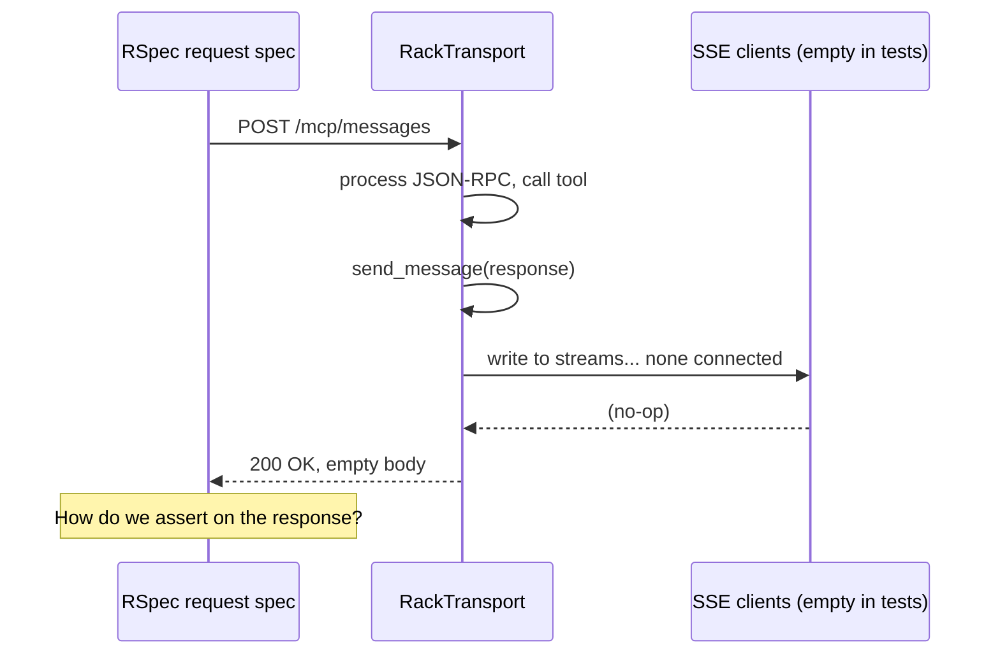

# Testing MCP tools and resources

The MCP test suite exercises the full HTTP stack — middleware, transport, fast-mcp dispatch, tool/resource code, serialization — using **request specs**. This document explains why the test setup looks the way it does and how to write a new spec.

---

## Table of contents

1. [Overview](#overview)
2. [Test helper: `McpRequestHelpers`](#test-helper-mcprequesthelpers)
3. [Why tests stub `send_message`](#why-tests-stub-send_message)
4. [Why tests stub `validate_origin` and `valid_client_ip?`](#why-tests-stub-validate_origin-and-valid_client_ip)
5. [Spec template](#spec-template)
6. [Patterns for common assertions](#patterns-for-common-assertions)
7. [What we are NOT testing](#what-we-are-not-testing)

---

## Overview

All MCP specs are RSpec request specs (`type: :request`). They:

1. Build a JSON-RPC request body with one of the helpers.
2. `POST /mcp/messages` with a JWT in the `Authorization` header.
3. Read the captured response with `mcp_result` / `mcp_response`.
4. Assert on the returned data **and** on DB side-effects.

Following the project convention from `Api::V1` specs, each describe block has two contexts:

- `when it is an unauthenticated user` — asserts `401`.
- `when it is an authenticated user` — asserts behaviour.

---

## Test helper: `McpRequestHelpers`

File: [spec/support/mcp_request_helpers.rb](../../spec/support/mcp_request_helpers.rb)

```ruby
module McpRequestHelpers
  def mcp_tool_call_body(tool_name, arguments = {})
    { jsonrpc: '2.0', method: 'tools/call',
      params: { name: tool_name, arguments: arguments }, id: 1 }.to_json
  end

  def mcp_resource_read_body(uri)
    { jsonrpc: '2.0', method: 'resources/read', params: { uri: uri }, id: 1 }.to_json
  end

  def mcp_response
    payload = Thread.current[:mcp_captured_response]
    raise 'No MCP response was captured for this request' unless payload

    payload
  end

  def mcp_result
    payload = mcp_response
    raise payload['error'].inspect if payload['error']

    result = payload['result'] || {}
    contents = result['content'] || result['contents']
    text = contents&.first&.dig('text')
    raise "MCP tool returned error: #{text}" if result['isError']

    text.present? ? JSON.parse(text) : result
  end
end

RSpec.configure do |config|
  config.include McpRequestHelpers, type: :request

  config.before(:each, type: :request) do
    Thread.current[:mcp_captured_response] = nil
    allow_any_instance_of(FastMcp::Transports::RackTransport).to receive(:send_message) do |_, message|
      Thread.current[:mcp_captured_response] = JSON.parse(message.is_a?(String) ? message : JSON.generate(message))
    end
    allow_any_instance_of(FastMcp::Transports::RackTransport).to receive(:valid_client_ip?).and_return(true)
    allow_any_instance_of(FastMcp::Transports::RackTransport).to receive(:validate_origin).and_return(true)
  end
end
```

Public surface:

| Helper | Purpose |
|---|---|
| `mcp_tool_call_body(name, args)` | Builds the JSON body for `tools/call`. |
| `mcp_resource_read_body(uri)` | Builds the JSON body for `resources/read`. |
| `mcp_response` | Returns the raw captured JSON-RPC envelope. Use for asserting on errors. |
| `mcp_result` | Returns the parsed `result.content[0].text` (tools) or `result.contents[0].text` (resources). Raises a clear error if the tool returned `isError: true`. |

---

## Why tests stub `send_message`

fast-mcp delivers tool/resource responses over the SSE channel — **not** in the `POST /mcp/messages` response body. The POST is just an acknowledgement (`200 OK` with empty body).

In `Rack::Test` (used by Rails request specs) there is no open SSE connection. When `send_message` runs, it iterates `@sse_clients` which is empty, and the message is dropped.



The stub intercepts `send_message`, captures the response object in `Thread.current[:mcp_captured_response]`, and exposes it to specs through `mcp_response` / `mcp_result`. Without this, every tool spec would have no way to read the actual response.

---

## Why tests stub `validate_origin` and `valid_client_ip?`

The fast-mcp transport runs two security checks **before** dispatching:

1. `valid_client_ip?` — IP allowlist.
2. `validate_origin` — DNS rebinding protection based on the `Origin` header.

In production these check against `allowed_origins` set in the initializer. In `Rack::Test` the default host is `www.example.com`. Even though `allowed_origins` includes `example.com` and `/.*\.example\.com/`, the `valid_client_ip?` check can still reject the test request depending on environment.

The simpler approach (matching the rest of the test infra) is to stub both checks to `true` for request specs. This isolates the tests from network-layer concerns and lets them focus on tool/resource logic.

---

## Spec template

Use this skeleton when writing a new tool spec:

```ruby
require 'rails_helper'

RSpec.describe 'MCP tool: contacts_list', type: :request do
  let!(:account) { create(:account) }
  let!(:user) { create(:user, account: account) }
  let(:auth_headers) do
    { 'Authorization' => "Bearer #{Users::JsonWebToken.encode_user(user)}",
      'Content-Type' => 'application/json' }
  end

  # Set up domain fixtures with let!
  let!(:john) { create(:contact, full_name: 'John Doe') }

  context 'when it is an unauthenticated user' do
    it 'returns unauthorized' do
      post '/mcp/messages', params: mcp_tool_call_body('contacts_list'),
                            headers: { 'Content-Type' => 'application/json' }
      expect(response).to have_http_status(:unauthorized)
    end
  end

  context 'when it is an authenticated user' do
    it 'returns all contacts when no filter is provided' do
      post '/mcp/messages', params: mcp_tool_call_body('contacts_list'), headers: auth_headers
      expect(response).to have_http_status(:ok)
      expect(mcp_result['data'].pluck('id')).to include(john.id)
    end
  end
end
```

For a resource spec, use `mcp_resource_read_body` instead:

```ruby
post '/mcp/messages', params: mcp_resource_read_body("woofed:///contacts/#{john.id}"), headers: auth_headers
payload = mcp_result   # the parsed contact JSON
```

---

## Patterns for common assertions

### Happy path with DB state

```ruby
it 'creates a contact with all submitted attributes' do
  expect do
    post '/mcp/messages', params: mcp_tool_call_body('contacts_create', arguments), headers: auth_headers
  end.to change(Contact, :count).by(1)
  expect(Contact.last).to have_attributes(full_name: 'Tim Maia', email: 'tim@maia.com')
end
```

### Error from the tool (validation, not-found)

```ruby
it 'returns not found when the contact does not exist' do
  post '/mcp/messages', params: mcp_tool_call_body('contacts_update', { id: 99_999 }), headers: auth_headers
  expect(mcp_result).to include('status' => 'not_found',
                                'error' => 'Resource could not be found')
end
```

### JSON-RPC level error

If the tool raises an unhandled exception, fast-mcp returns `result.isError: true` with a stringified error. `mcp_result` raises in that case, so the spec fails clearly:

```
MCP tool returned error: Error: undefined local variable...
```

Use this to detect bugs in the tool itself.

### Pagination

```ruby
it 'paginates results' do
  post '/mcp/messages', params: mcp_tool_call_body('contacts_list', { per_page: 1, page: 1 }),
                        headers: auth_headers
  expect(mcp_result['data'].size).to eq(1)
  expect(mcp_result['pagination']).to include('count' => 2, 'pages' => 2)
end
```

### Date range filters

`updated_at` cannot be set at `create` time the same way `created_at` can. Update it explicitly:

```ruby
it 'filters by updated_at range' do
  john.update!(updated_at: 1.day.ago)
  post '/mcp/messages', params: mcp_tool_call_body('contacts_list', { updated_from: 2.hours.ago.iso8601 }),
                        headers: auth_headers
  expect(mcp_result['data'].pluck('id')).to eq([jane.id])
end
```

---

## What we are NOT testing

The stub strategy means a few things are **outside** the scope of the automated suite:

| Not tested | Reason | Mitigation |
|---|---|---|
| Live SSE delivery (the actual `data: ...\n\n` framing) | `Rack::Test` does not maintain a streaming connection. | Trust fast-mcp's own test suite. Optionally add a manual E2E test that spins up Puma. |
| `valid_client_ip?` / `validate_origin` real behaviour | Stubbed for all request specs. | Trust fast-mcp's own tests. The allowed_origins config is verified by inspection. |
| Cross-thread `Current.user` isolation | Hard to simulate in a single-threaded Rack::Test. | Pattern verified by `Current.set` semantics and `Current.reset` in `ensure`. |

If you need end-to-end SSE confidence, add a separate integration spec that boots a real Puma process and uses `Net::HTTP` to read the SSE stream. Keep it out of the main suite for speed.
