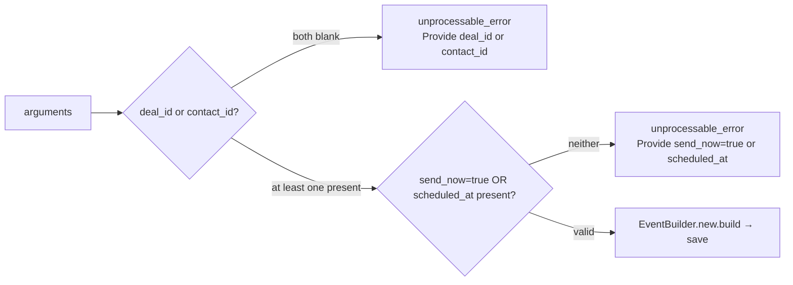

# Tools: events

Events live on a deal/contact timeline. The MCP server exposes four event-creation tools, each one corresponding to a `kind` value:

| Tool | `kind` | File |
|---|---|---|
| [`events_create_note`](#events_create_note) | `note` | [app/tools/events/create_note_tool.rb](../../../app/tools/events/create_note_tool.rb) |
| [`events_create_activity`](#events_create_activity) | `activity` | [app/tools/events/create_activity_tool.rb](../../../app/tools/events/create_activity_tool.rb) |
| [`events_send_chatwoot_message`](#events_send_chatwoot_message) | `chatwoot_message` | [app/tools/events/send_chatwoot_message_tool.rb](../../../app/tools/events/send_chatwoot_message_tool.rb) |
| [`events_send_whatsapp_message`](#events_send_whatsapp_message) | `evolution_api_message` | [app/tools/events/send_whatsapp_message_tool.rb](../../../app/tools/events/send_whatsapp_message_tool.rb) |

There is no `events_list` tool — events are returned embedded in the `woofed:///contacts/{id}` resource.

---

## Shared semantics

All four tools share these behaviours:

### Either `deal_id` or `contact_id` is required

Each tool returns a structured error if both are blank:

```json
{ "error": "Provide deal_id or contact_id", "status": "unprocessable_entity" }
```

### Auto-derived `contact_id`

`Event.belongs_to :contact` is **not optional**. When the caller passes only `deal_id`, the tool fetches the deal and derives `contact_id`:

```ruby
contact_id ||= Deal.find(deal_id).contact_id
```

This means the LLM can fire-and-forget against a deal without having to look up the contact first.

### EventBuilder

All four tools use [`EventBuilder`](../../../app/builders/event_builder.rb) — the same builder used by the REST API and the web UI. It handles:

- Finding the contact/deal records.
- Setting `event.contact` and `event.deal` correctly.
- Marking notes as `done: true` automatically.
- File handling (not used by MCP tools currently).

### `from_me: true`

All MCP-created events are marked `from_me: true`, indicating the message was authored on the CRM side (vs. coming from an inbound webhook).

---

## `events_create_note`

Add a free-text note to a deal/contact timeline. No external side effects (no Chatwoot/WhatsApp delivery).

### Arguments

| Name | Type | Required | Description |
|---|---|---|---|
| `deal_id` | integer | one of these | Deal to attach the note to |
| `contact_id` | integer | one of these | Contact to attach the note to |
| `content` | string | **yes** | Note body (rich text supported) |
| `title` | string | no | Optional title for the timeline entry |

### Behaviour

- Sets `kind: 'note'`.
- Sets `done: true` automatically (notes are not "scheduled" things).
- Triggers the standard `event_created` Wisper broadcast.

---

## `events_create_activity`

Schedule a task or planned interaction (call, meeting, follow-up).

### Arguments

| Name | Type | Required | Description |
|---|---|---|---|
| `deal_id` | integer | one of these | |
| `contact_id` | integer | one of these | |
| `title` | string | **yes** | Activity title, e.g. *"Follow-up call"* |
| `content` | string | no | Notes/agenda |
| `scheduled_at` | string (ISO8601) | no | When the activity is scheduled |
| `done` | boolean | no | Mark as already done. Defaults to `false`. |

### Behaviour

- Sets `kind: 'activity'`.
- If `scheduled_at` is in the future, a push notification job (`Pwa::SendNotificationsWorker`) is scheduled.

---

## `events_send_chatwoot_message`

Send (immediately) or schedule a message via a Chatwoot inbox.

### Arguments

| Name | Type | Required | Description |
|---|---|---|---|
| `deal_id` | integer | one of these | |
| `contact_id` | integer | one of these | |
| `content` | string | **yes** | Message body |
| `app_id` | integer | **yes** | ID of the `Apps::Chatwoot` integration (use [`apps_chatwoots_list`](apps.md#apps_chatwoots_list) to discover) |
| `chatwoot_inbox_id` | string | **yes** | Target inbox. Lives inside `inboxes` returned by `apps_chatwoots_list`. |
| `send_now` | boolean | one of these | Send immediately |
| `scheduled_at` | string (ISO8601) | one of these | Schedule for later |

### Required combinations



### Behaviour

- Sets `kind: 'chatwoot_message'`, `app_type: 'Apps::Chatwoot'`, `title: 'Chatwoot Message'`.
- Stores `chatwoot_inbox_id` in `additional_attributes`.
- `auto_done` is set to `!send_now`: scheduled messages are auto-marked done when sent.
- If `send_now: true`, the `Accounts::Contacts::Events::SendNow` use case runs in the same request (synchronous send).
- If `scheduled_at` is set, an `Accounts::Contacts::Events::EnqueueWorker` Sidekiq job is enqueued.

---

## `events_send_whatsapp_message`

Send or schedule a WhatsApp message via Evolution API.

### Arguments

| Name | Type | Required | Description |
|---|---|---|---|
| `deal_id` | integer | one of these | |
| `contact_id` | integer | one of these | |
| `content` | string | **yes** | Message body |
| `app_id` | integer | **yes** | ID of the `Apps::EvolutionApi` integration (use [`apps_evolution_apis_list`](apps.md#apps_evolution_apis_list)) |
| `send_now` | boolean | one of these | Send immediately |
| `scheduled_at` | string (ISO8601) | one of these | Schedule for later |

### Behaviour

Same shape as `events_send_chatwoot_message` but with:

- `kind: 'evolution_api_message'`
- `app_type: 'Apps::EvolutionApi'`
- `title: 'Whatsapp Message'`
- No `additional_attributes` (Evolution API doesn't need an inbox id; the integration itself targets a specific phone).
